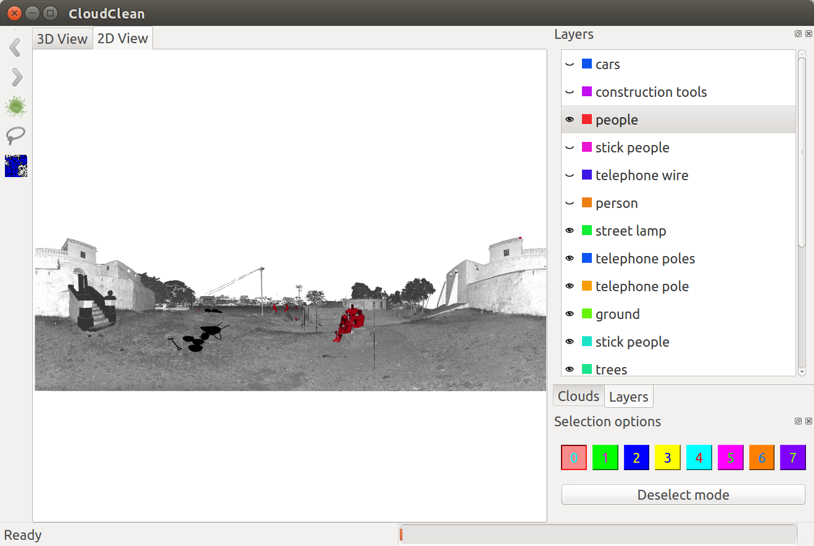

# CloudClean


## PREREQUISITES

* Cross-platform Make (CMake) v2.6.2+
* GNU Make or equivalent.
* GCC or an alternative, reasonably conformant C++ compiler.
* Boost C++ Libraries v1.37+ [HEADERS and LIBRARIES]
* Qt Framework v4.5+
* UnitTest++ (a.k.a. unittest-cpp)
# CloudClean


## BUILDING (Ubuntu 16.04)
 
- ```git clone ```
- ```git submodule init```
- ```git submodule update```
- ```git submodule update --init --recursive```
- ```sudo add-apt-repository ppa:v-launchpad-jochen-sprickerhof-de/pcl -y```
- ```sudo apt-get update -d```
- ```sudo apt-get install gcc g++ libsvm-dev libconfig++8-dev libblas-dev libatlas-base-dev liblapack-dev libgmm++-dev cmake libgomp1 libpng12-0 libqhull5 libusb-1.0-0 libboost1.53-all-dev nvidia-opencl-dev qtbase5-dev mesa-common-dev libflann-dev libeigen3-dev```
- ```wget http://public.jacklab.co.za/PCL-1.7.0-Linux.deb```
- ```sudo dpkg -i PCL-1.7.0-Linux.deb```
- ```mkdir build && cd build```
- ```cmake -DCMAKE_BUILD_TYPE=Release ..```
- ```make -j2```

## INSTALLING

 Once the project has been built (see "BUILDING"), execute "sudo make install".

## CONTRIBUTING

1. Fork it!
2. Create your feature branch: `git checkout -b my-new-feature`
3. Commit your changes: `git commit -am 'Add some feature'`
4. Push to the branch: `git push origin my-new-feature`
5. Submit a pull request :D

## License
MIT